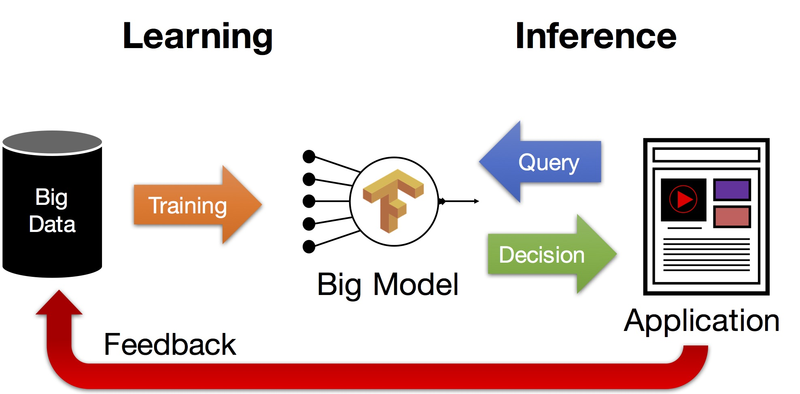

This lecture covers an overview of Intel SGX, hardware extensions for security, the mechanism of remote attestation, and how it can be used for cloud security. 

### Reading list:


 <a href="https://software.intel.com/sites/default/files/article/413936/hasp-2013-innovative-instructions-and-software-model-for-isolated-execution.pdf
">Intel SGX</a>, McKeen et al


<a href="https://software.intel.com/sites/default/files/managed/ac/40/2016%20WW10%20sgx%20provisioning%20and%20attesatation%20final.pdf
"> Remote attestation</a>, Johnson et al


 <a href="https://www.usenix.org/system/files/conference/osdi14/osdi14-paper-baumann.pdf">
Haven,  </a> Baumann et al

### Optional reading:

If some things are unclear from the readings above, these references should help:

<a href="https://www.youtube.com/watch?v=mPT_vJrlHlg">Presentation by one of the SGX creators</a>, Frank Mckeen

<a href="https://eprint.iacr.org/2016/086.pdf">Intel SGX explained</a>, Costan and Devadas. This report covers at length Intel SGX as well as computer architecture, security, and cryptography knowledge needed to understand it. Sections 1.1 and 5 are particularly relevant.


### Questions:

1. During the execution of a program, each enclave page is encrypted and authenticated. What prevents the operating system from swapping a page with an older version of this page from the same execution? Both the current and the old version have been authenticated at some point in time.

2. Summarize the basic steps in a remote attestation process. 

3. Consider that three different parties, A, B, C, each have an input iA, iB, iC and want to compute a publicly-known function f(iA, iB, iC) such that they all learn the result, but none of them learns anything more than the result (and their own input). What are the high level steps one can take to use SGX for this purpose? 

4. Why does Haven go through the overhead and complexity of using Library OS + Drawbridge instead of simply issuing system calls?

4. Can a bug in the database or LibOS exfiltrate unencrypted data in Haven? 

5. In Haven, can the operating system swap a page with an older page across machine shutdown? Explain.


<!--
{:width="400px"}

While much of the focus of machine learning research is on the process of training models (i.e., learning) there are a unique set of challenges around the process of serving and updating those models that is often overlooked.
In this lecture we will explore the bigger machine learning life-cycle and discuss the challenges around serving predictions.

## Reading lists:

### Prediction Serving Systems [?Student Presenters?]
1. *Deepak Agarwal, Bo Long, Jonathan Traupman, Doris Xin, and Liang Zhang.* 2014. [**LASER: a scalable response prediction platform for online advertising.**](http://dl.acm.org/citation.cfm?id=2556252) In Proceedings of the 7th ACM international conference on Web search and data mining (WSDM '14).


### Managing the ML Lifecycle [?Student Presenters?]
1. *Xinran He, Junfeng Pan, Ou Jin, Tianbing Xu, Bo Liu, Tao Xu, Yanxin Shi, Antoine Atallah, Ralf Herbrich, Stuart Bowers, and Joaquin Quiñonero Candela.* 2014. [**Practical Lessons from Predicting Clicks on Ads at Facebook.**](http://dl.acm.org/citation.cfm?id=2648589) In Proceedings of the Eighth International Workshop on Data Mining for Online Advertising (ADKDD'14).

1. *D. Sculley, Gary Holt, Daniel Golovin, Eugene Davydov, Todd Phillips, Dietmar Ebner, Vinay Chaudhary, Michael Young* 2014. [**Machine Learning: The High Interest Credit Card of Technical Debt**](http://research.google.com/pubs/pub43146.html). SE4ML: Software Engineering for Machine Learning (NIPS 2014 Workshop)


### Questions:

1. What differentiates serving machine learning models from standard data serving?

1. Name one way in which algorithmic advances simplify model serving and one way in which they add additional challenges.
 -->


<!--

Formatting with Kramdown (github style markdown):

https://github.com/adam-p/markdown-here/wiki/Markdown-Cheatsheet

# heading 1
## heading 2
### heading 3


# A list

1. a
1. b
1. c

*italic*
**bold**

```scala
// this is scala
def f(x) = x + 3
```

```bash
%> echo "the end" | less
```


# An inline equation without number:

this is all about $x$ and $\alpha$:

$$
3x + 5
$$

# An inline equation with numbering

\begin{align}
y \propto \frac{x \sin x} {\int_0^\infty x \sin x}
\end{align}
 -->

<!-- {: style="text-align: center"} -->


